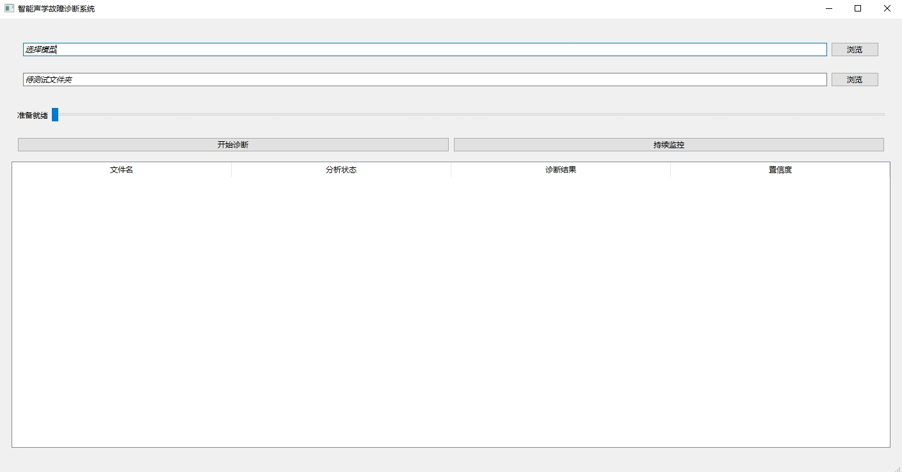

# Causal-Bilinear-Generalization-Network

在“[trained models](https://drive.google.com/drive/folders/17fMiulPXF-7IOFExEVd99Z7xuP_eXLP3?usp=sharing)”中下载.pth文件，将文件地址导入到loadCheckpointTest.py中，即可查看测试结果，所用数据集为[MIMII DG](https://zenodo.org/records/6529888)和[MIMII](https://zenodo.org/record/3384388)， https://drive.google.com/drive/folders/17Kz4HvcyOePa35TeIww1ZQHgzvdyPY7Q?usp=sharing (已经做好了预处理)。

本论文实验部分中对比方法的论文复现代码存放于：otherMethods

Download the .pth file from the “[trained models](https://drive.google.com/drive/folders/17fMiulPXF-7IOFExEVd99Z7xuP_eXLP3?usp=sharing)” and import the file path into loadCheckpointTest.py to view the test results. The dataset used are [MIMII DG](https://zenodo.org/records/6529888) and [MIMII](https://zenodo.org/record/3384388), https://drive.google.com/drive/folders/17Kz4HvcyOePa35TeIww1ZQHgzvdyPY7Q?usp=sharing (Preprocessing has been completed).

The reproduction codes for the comparative methods in the experimental section are stored in: otherMethods.

# 界面设计
我们为DGCDN做了简单的界面Demo(存放于Qt中)，具体实现了如下功能：
1. 使用选择的预训练好的模型对选择的文件夹进行故障诊断
2. 使用选择的预训练好的模型对选择的文件夹进行持续监控
3. 对于诊断结果进行诊断结果展示，对于持续监控任务进行实时结果展示

界面如图所示：

